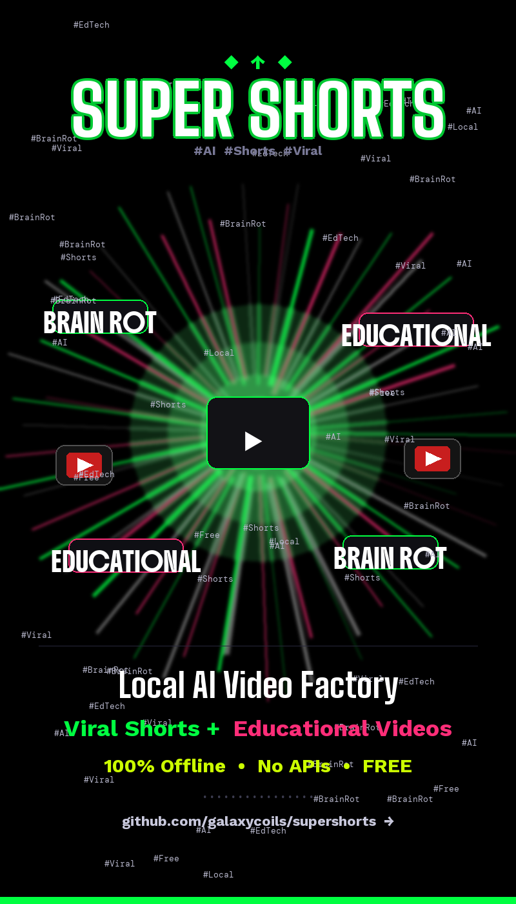

# SuperShorts v2.2

**Fully local AI video factory — educational videos, viral Shorts, RotGen brain rot, and expert-crafted YouTube content packages. Zero paid APIs.**

<p align="center">
  
</p>


---

## What It Does

SuperShorts is a fully local video production pipeline. Drop it on any Mac or Linux box, run `python main.py`, and it writes, narrates, edits, and uploads YouTube videos entirely on-device.

- **Educational series** — 20-lesson AI curriculum, long-form + linked Shorts
- **Brain rot Shorts** — sensationalized AI hooks with viral gameplay backgrounds
- **RotGen Character Mode** — animated ByteBot avatar narrates over gameplay (rotgen.org style)
- **YouTube Content Package** *(new v2.2)* — expert AI strategist picks a trending topic, writes a 600-800 word science-backed script, produces a full 5-minute video, and uploads it automatically

No OpenAI. No Anthropic. No paid APIs of any kind.

---

## Menu (10 options)

```
  [1]  📚  Educational Videos         Long-form + linked Short (curriculum-based)
  [2]  🧠  Brain Rot Viral Shorts     Sensationalized AI shorts, 30–45 s
  [3]  🎮  Viral Gameplay Mode        Subway Surfers-style background + AI narration
  [4]  🎓  Tutorial Videos            ~10-min deep-dive + linked Short
  [5]  📈  Learning Mode              Self-improvement analysis from past uploads
  [6]  💡  YouTube Studio Ideas       Real YT suggestions, thumbnails & adapted scripts
  [7]  📋  View Content Plan          Browse lessons + brain rot topic tracker
  [8]  🎭  RotGen Character Mode      ByteBot AI character + gameplay + auto-subtitles
  [9]  📦  YouTube Content Package    Expert AI: topic → script → 5-min video → upload
  [10] 🚪  Exit
```

Live stats bar shows lessons done / brain rot topics done on every menu render.

---

## RotGen Character Mode (Option 8) — New in v2

Works like **rotgen.org**: animated character talking over gameplay, fully auto-pilot.

**Layout (1080×1920):**
```
┌────────────────────────────┐  y=0
│  CHARACTER PANEL  (768px)  │  ByteBot animated avatar, dark gradient
├────────────────────────────┤  y=768
│  GAMEPLAY VIDEO  (1152px)  │  subway surfers / minecraft / Pexels auto
└────────────────────────────┘  y=1920
```

Captions are handled by YouTube (auto-captions + an uploaded SRT sidecar) so
text never gets cropped on devices with a different aspect ratio.

**ByteBot character (`assets/characters/bytebot.png`):**
- PIL-drawn cartoon AI avatar with transparent background
- Cyan glowing eyes, circuit traces on cheeks, visor with LED dots, ByteBot badge
- 48-frame animation loop (2 s at 24 fps): head bob (sine wave), mouth open/close pulse, eye blink

**Auto-pilot flow:**
1. Random viral AI topic picked from 10 hooks
2. Ollama writes a ≤60-word ByteBot monologue
3. Piper TTS narrates (pyttsx3 fallback)
4. 48 character frames pre-generated (~0.12 s), freed after `gc.collect()`
5. Gameplay auto-selected: `assets/viral_gameplay/` → `assets/gameplay/` → Pexels queries
6. Proportional subtitle chunks composited as `ImageClip` layers
7. Encoded: H.264 ultrafast, 24 fps, AAC 192 k, 3 threads
8. Logged to `rotgen_plan.json`

Drop your own PNG into `assets/characters/` to replace ByteBot.

---

## Features

| Feature | Detail |
|---------|--------|
| **Educational curriculum** | Ollama generates a 20-lesson series; resumes where it left off |
| **Long-form videos** | 1920×1080, 7-8 slides, Pexels background, TTS + music |
| **Brain Rot Shorts** | 1080×1920, stroke text, 5 palettes, vignette, fast pacing |
| **Tutorial mode** | ~10-min deep-dive + linked Short, auto-uploaded pair |
| **Viral Gameplay mode** | Educational content with forced gameplay background |
| **YouTube Studio Ideas** | Real YouTube Data API v3 search → real thumbnails + adapted Ollama script |
| **Learning mode** | Ollama analyses past upload log, writes improvement suggestions |
| **RotGen Character mode** | Animated character + gameplay + subtitles — see above |
| **ANSI colour menu** | Live stats, emoji labels, descriptions per option |
| **Auto subtitle fitting** | `auto_scale_text` shrinks font until text fits; never overflows |
| **Emoji-safe TTS** | `strip_emojis()` removes all Unicode emoji ranges before speech |
| **tqdm progress bars** | ETA on every TTS, slide render, and video build loop |
| **Pexels caching** | Videos downloaded once, reused across runs |
| **Piper neural TTS** | Natural voice; pyttsx3 fallback if voice model missing |

---

## Prerequisites

- **Python 3.12+**
- **Ollama** running with `qwen2.5-coder:3b` pulled (`ollama pull qwen2.5-coder:3b`)
- **Firefox** logged in to YouTube (Selenium uploader drives this profile)
- **Pexels API key** — set `PEXELS_API_KEY` in `src/generator.py` or let the code use the bundled one
- *(Optional)* **Piper TTS** at `~/.local/share/piper-tts/voices/en-us-lessac-medium.onnx`
- *(Optional)* Gameplay MP4s in `assets/viral_gameplay/` for offline gameplay backgrounds
- *(Optional)* YouTube Data API key for Option 6 (prompted on first use, saved to `config.json`)

---

## Setup

```bash
git clone https://github.com/galaxycoils/supershorts
cd supershorts
python -m venv venv
source venv/bin/activate        # Windows: venv\Scripts\activate
pip install -r requirements.txt
ollama serve &
ollama pull qwen2.5-coder:3b
python main.py
```

---

## Project Structure

```
supershorts/
├── main.py                   # Entry point — menu dispatch + lesson production pipeline
├── menu.py                   # ANSI colour menu, live stats, content plan view
├── src/
│   ├── generator.py          # Core engine: LLM gen, TTS, PIL slides, MoviePy compose
│   ├── brainrot.py           # Brain Rot pipeline: topics, scripts, stroke slides, video
│   ├── rotgen.py             # RotGen Character Mode: ByteBot, animation, subtitles, compose
│   ├── ideagenerator.py      # YouTube Studio Ideas: YT API v3, thumbnail download, dialogue gen
│   ├── learning.py           # Upload logger + Ollama improvement analysis
│   ├── browser_uploader.py   # YouTube upload via Selenium + Firefox (DO NOT MODIFY)
│   └── uploader.py           # YouTube Data API v3 OAuth upload — backup (DO NOT MODIFY)
├── assets/
│   ├── characters/           # Drop custom PNG here to replace ByteBot
│   │   └── bytebot.png       # Default ByteBot character (RGBA, 400×500)
│   ├── backgrounds/          # Slide background images
│   ├── fonts/arial.ttf       # Font for all text rendering
│   ├── music/bg_music.mp3    # Background music (looped)
│   ├── gameplay/             # Local gameplay clips (optional)
│   ├── viral_gameplay/       # Subway Surfers / Minecraft clips (optional)
│   └── pexels/               # Cached Pexels background videos
├── output/                   # All generated audio, slides, and MP4s
├── content_plan.json         # Lesson curriculum (auto-generated)
├── brainrot_plan.json        # Brain Rot topic tracker
├── rotgen_plan.json          # RotGen video log
├── performance_log.json      # Upload history for Learning mode
└── requirements.txt
```

---

## Pipeline Diagram

```
Ollama (qwen2.5-coder:3b, local)
    │
    ├─ curriculum / lesson content / brainrot scripts / rotgen monologue
    │
    ▼
Piper TTS  (pyttsx3 fallback)
    │
    ├─ narration → .wav per slide / per video
    │
    ▼
PIL (Pillow 12.2+)
    │
    ├─ slide images 1920×1080 or 1080×1920
    ├─ auto_scale_text: shrink font until fits
    ├─ brainrot: stroke text + numpy vignette gradient (285× vs pixel loop)
    ├─ rotgen: 48-frame character animation at 24fps (0.12s build time)
    │
    ▼
MoviePy 1.0.3
    │
    ├─ CompositeVideoClip: background + slide/character
    ├─ ImageSequenceClip for character animation (frames cached to disk after first build)
    ├─ Pexels auto-download + cache
    ├─ h264_videotoolbox on Apple Silicon (~3-5× faster than libx264 ultrafast); libx264 elsewhere
    ├─ TTS + slide rendering parallelised across cores
    │
    ▼
Selenium + Firefox  (YouTube upload)
    │
    ├─ Waits for the share link to appear in Studio (size-scaled, not a fixed 10s sleep)
    ├─ Polls YouTube Data API v3 until videos.list reports processed/succeeded
    ├─ Optional SRT sidecar so auto-captions are accurate
    ├─ On success: delete local mp4/wav/png, append breadcrumb to upload_history.json
```

---

## Configuration

**`src/generator.py` constants:**

| Variable | Default | Description |
|----------|---------|-------------|
| `YOUR_NAME` | `"Chaitanya"` | Creator name in footers / descriptions / branding |
| `PEXELS_API_KEY` | set yours | Pexels API key for background videos |
| `LESSONS_PER_RUN` | `2` (in `main.py`) | Lessons per Option 1 run |
| `SHORTS_PER_RUN` | `3` (in `brainrot.py`) | Brain Rot Shorts per Option 2 run |

**YouTube Data API key** (Option 6 + upload completion polling): prompted on
first use for Option 6, saved to `config.json`. The uploader also reads
`YOUTUBE_API_KEY` from the environment; whichever is set is used to poll
`videos.list?part=status,processingDetails` until the upload has actually
finished processing (up to 30 min for long videos). Without a key, the
uploader falls back to a size-scaled sleep.

**Firefox profile:** override with `YT_FIREFOX_PROFILE=/path/to/profile` if
you aren't on the default Mac path.

**Auto-cleanup + upload history:** after every successful upload the mp4,
intermediate audio, slide PNGs, and thumbnails are deleted, and a one-line
breadcrumb (title, mode, video ID, size, deleted paths) is appended to
`upload_history.json` at the repo root. Failed uploads keep their files
untouched so you can retry.

---

## Requirements

```
ollama
pyttsx3
pydub
moviepy==1.0.3
Pillow>=12.2.0
numpy
google-api-python-client
google-auth-httplib2
google-auth-oauthlib
requests
selenium
webdriver-manager
tqdm
```

---

## Notes

- **Upload flow is stable** — `src/browser_uploader.py` and `src/uploader.py` not touched by new features
- **Ollama must be running** — `ollama serve` before launching
- **All AI is local** — no calls to paid APIs; Pexels is the only external network dependency (cached after first use)
- **Custom RotGen character** — drop any RGBA PNG into `assets/characters/`; the pipeline auto-loads the first file found
- **Memory-safe** — character frames freed with `gc.collect()` after `ImageSequenceClip` built (~115MB peak)
- **macOS note** — ImageMagick binary set to `/opt/homebrew/bin/convert`; adjust in `generator.py` if needed

---

## Changelog

### v2.0 — 2026-04-16
- **RotGen Character Mode** (Option 8): ByteBot animated AI character + auto gameplay + live subtitles
- **ByteBot asset** (`assets/characters/bytebot.png`): PIL-drawn RGBA avatar, custom character support
- **YouTube Studio Ideas** (Option 6): YouTube Data API v3 real suggestions + thumbnail downloads + Ollama dialogue adaptation
- **ANSI colour menu**: live stats bar, emoji labels, descriptions, coloured content plan viewer
- **Brain Rot performance**: numpy gradient replaces 2M pixel loop (285× speedup, 0.80s → 0.003s per slide)
- **Pillow 12.2** upgrade: patched 4 CVEs (1 critical arbitrary code exec, 3 high)
- **Tutorial mode** (Option 4): ~10-min deep-dive videos with linked Short
- **tqdm progress bars**: ETA on all TTS, slide, and video build loops
- **Emoji-safe TTS**: Unicode regex strips all emoji ranges before speech synthesis
- **Learning mode** (Option 5): Ollama analyses upload history, writes improvement suggestions

### v1.0 — initial
- Educational curriculum, Brain Rot Shorts, Selenium upload

---

## License

MIT
