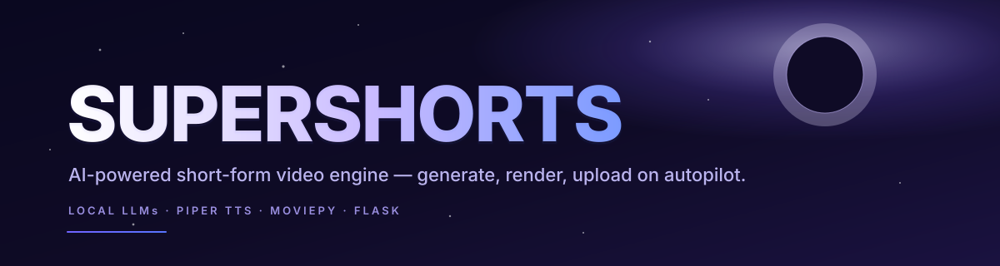
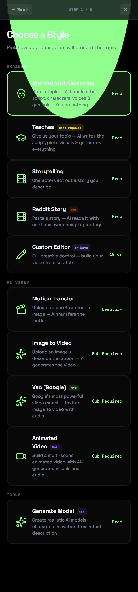
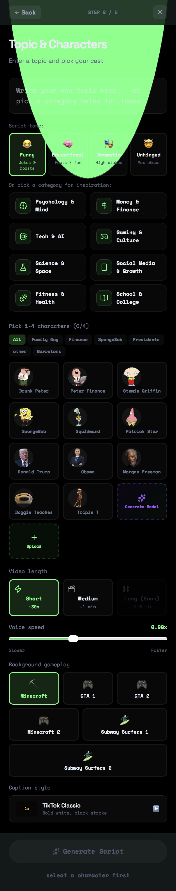
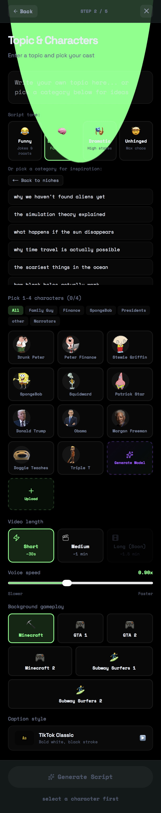

<div align="center">



[](https://github.com/galaxycoils/supershorts/actions/workflows/ci.yml)
[](LICENSE)
[](https://www.python.org/downloads/)
[](https://github.com/astral-sh/ruff)
[](https://github.com/galaxycoils/supershorts/commits/main)

**Generate, render, and upload viral YouTube Shorts, TikToks, and Reels — fully on autopilot, with local LLMs and zero API cost.**

[Features](#-features) · [Quickstart](#-quickstart) · [Architecture](#-architecture) · [Screenshots](#-screenshots) · [Roadmap](#-roadmap)

</div>

---

## ✨ Features

- 🎭 **Character-driven production** — pick from 9+ AI voices and avatars (Adam, Antoni, Arnold, Rachel…) with auto overlays.
- 🧠 **Local LLMs only** — Ollama or LM Studio (OpenAI-compatible). No API bills, no rate limits.
- 🎙 **Piper TTS** — neural text-to-speech, near-realtime, 9+ voices.
- 🎬 **MoviePy engine** — dynamic layering, auto-captions, music ducking, "Chain" concat (40% lower memory).
- 📱 **Multiple modes** — Brainrot, TCM (Teaches), RotGen split-screen, Clipper (long-form → vertical).
- 🧰 **3-step production modal** — Identity → Concept → Precision, with temperature & 720p/1080p controls.
- 🤖 **Selenium uploader** — hands-free YouTube Studio integration.
- 📊 **Real-time dashboard** — Server-Sent Events for zero-latency render telemetry.

---

## 🚀 Quickstart

```bash
git clone https://github.com/galaxycoils/supershorts.git
cd supershorts
python3 -m venv venv && source venv/bin/activate
pip install -r requirements.txt
./scripts/download_voices.sh
python3 dashboard.py
```

Then open **http://localhost:5050**.

<details>
<summary><b>Prerequisites</b></summary>

- **Python 3.10+**
- **Firefox** — required for the Selenium uploader
- **Local LLM** — [Ollama](https://ollama.com) or [LM Studio](https://lmstudio.ai)
- **Piper TTS binary** — must be on `$PATH`

</details>

---

## 🏗 Architecture

<table>
<tr>
<td width="50%" valign="top">

**Frontend — Command Center**
- Vanilla JS, componentized
- Tranquil Eclipse aesthetic (deep indigo, soft lunar glow)
- Mobile-first responsive layout
- Server-Sent Events for live telemetry

</td>
<td width="50%" valign="top">

**Backend — Production Pipeline**
- Flask API for jobs, assets, telemetry
- Ollama / LM Studio for scripts & topics
- Piper TTS for synthesis
- MoviePy compositor + Selenium uploader

</td>
</tr>
</table>

```text
├── dashboard.py           # Flask backend & API gateway
├── templates/             # HTML5 templates
├── static/                # CSS, JS, avatars
├── scripts/               # Voice downloaders, helpers
├── src/
│   ├── modes/             # Brainrot, TCM, RotGen, Clipper
│   ├── engine/            # MoviePy compositor
│   ├── infrastructure/    # LLM, TTS, uploader services
│   └── core/              # Interfaces & config
└── assets/                # Backgrounds, characters, music
```

---

## 📸 Screenshots

<details>
<summary><b>Click to expand — Command Center, Production Modal, Gallery</b></summary>

<br/>

<table>
<tr>
<td align="center" width="33%"><sub><b>Command Center</b></sub></td>
<td align="center" width="33%"><sub><b>Production Modal</b></sub></td>
<td align="center" width="33%"><sub><b>Gallery</b></sub></td>
</tr>
<tr>
<td align="center"></td>
<td align="center"></td>
<td align="center"></td>
</tr>
</table>

</details>

---

## 📈 Roadmap

| Version | Milestone                                    | Status |
|--------:|----------------------------------------------|:------:|
| v3.5.0  | Componentized UI & RotGen aesthetic          | ✅ |
| v3.6.0  | Multi-LLM provider support (LM Studio)       | ✅ |
| v3.7.0  | Multi-platform uploads (TikTok, Instagram)   | 🚧 |
| v3.8.0  | Cloud-synced asset library                   | 🔭 |
| v3.9.0  | AI-driven B-Roll selection                   | 🔭 |

---

## 🤝 Contributing

Pull requests welcome. Fork → feature branch → PR. Run `pytest` and keep coverage above the floor in `.coverage-thresholds.json`.

## 📄 License

[MIT](LICENSE) — © SuperShorts contributors.
